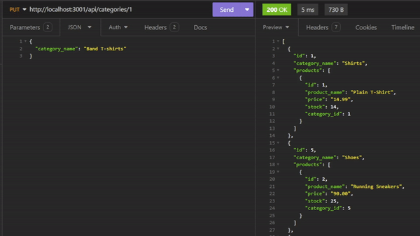

# eCommerce Backend
Backend application used to keep track of products.

## Description
This application allows the user to enter in product information to a database. After adding product to the database the user can then search for products, update products, and delete them.

## Table of Contents
- [Installation](#installation)
- [Usage](#usage)
- [License](#license)
- [Questions](#questions)

## Installation
This Application requires [Nodejs](https://nodejs.org/) to be installed.
 
 Once you have downloaded this repository to your local machine, navigate within the command line to the folder that contains "package.json". 
 Once there type in "npm install" to the install the required dependancies sequelize, express.js, dotenv(You will need to create your own .env file to log into your own database), and postgres. 

## Usage
Once you have finished the installation process you can start the application by typing "npm run start" from the command line. At any point if you wish to quit you can hit CTRL + C.
  
Note that unless you add product to the database or use the command "npm run seed" to give dummy data there will be nothing within the database.
  
Every end point is capable of performing C.R.U.D. operations. Sending a get request to /api/"endpoint" will show every item within the endpoint. Adding a /"product #" will give you specific information about one product. To add a product to the database send a post request to /api/"endpoint" and it will add the body of the request to the database. You can update a previously added item using a put request to a specific item by following the route /api/"endpoint"/"# of product to update" and it will update what you send in the request body. You can also delete a product by sending a delete request to the route /api/"endpoint"/"# of product your deleting".
  

The following video demonstrations should an exmaple user would use each route of the database.

A GET request for products 
  

A GET request for tags 
  

A GET request for categories 
  

All these endpoints as listed above can do a GET request for a specific ID
  

As well as do an update request based on what properties of the product you want to update
  

And finally all routes can delete an entry using the entry's id
  

## License
This project is licensed under the MIT license.

## Questions
If you have any questions, please feel free to reach out to me at my GitHub: [drewhermanson](https://github.com/drewhermanson)
or by email: drew.hermanson@gmail.com
